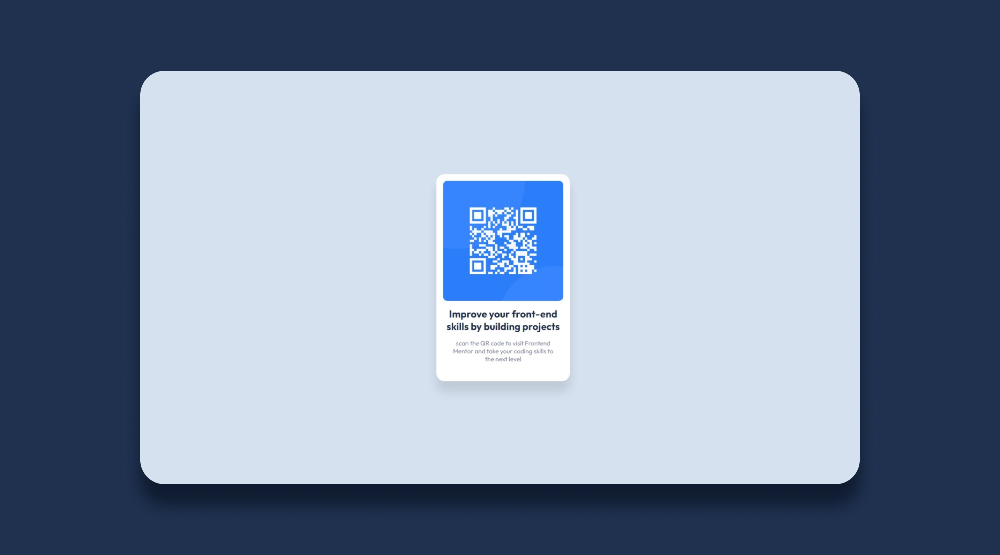

# Frontend Mentor - QR code component solution

This is a solution to the [QR code component challenge on Frontend Mentor](https://www.frontendmentor.io/challenges/qr-code-component-iux_sIO_H). 

## Table of contents

  - [Screenshot](#screenshot)
  - [Links](#links)
  - [Built with](#built-with)
  - [What I learned](#what-i-learned)
  - [Continued development](#continued-development)
  - [Author](#author)

### Screenshot



### Links

- Solution URL: [Add solution URL here](https://your-solution-url.com)
- Live Site URL: [live site URL](https://geechucks.github.io/QRcodeWebsite/)

### Built with

- CSS custom properties
- Flexbox


### What I learned

I've been learning the basics of HTML and CSS through YouTube, but I have never really put 
my knowledge into practice until I decided to join this challenge. This is my first
coding challenge and I've learnes a lot.

I've learned how to use flex box layout model for centering. Flex box offers more control
over alignment, spacing and distribution of elements.

```html
<h1>Some HTML code I'm proud of</h1>
```
```css
body{
      background-color: #D5E1EF;
      height: 100vh;
      display: flex;
      justify-content: center;
      align-items: center;
      font-family: 'Outfit';

    }
```
```css
.img-container{
      background-color: blue;
      position: relative;
      width: 288px;
      height: 288px;
      overflow: hidden;
      border-radius: 10px;
      margin: 16px;
    }
```

### Continued development

CSS layouts is the area that I wanna improve on.

## Author

- Twitter - [@Gee_Chagane](https://www.twitter.com/@Gee_Chagane)


